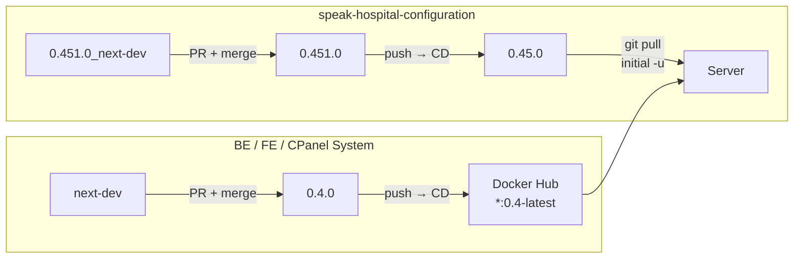
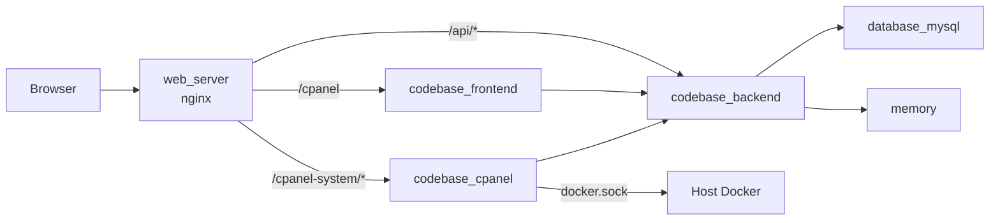
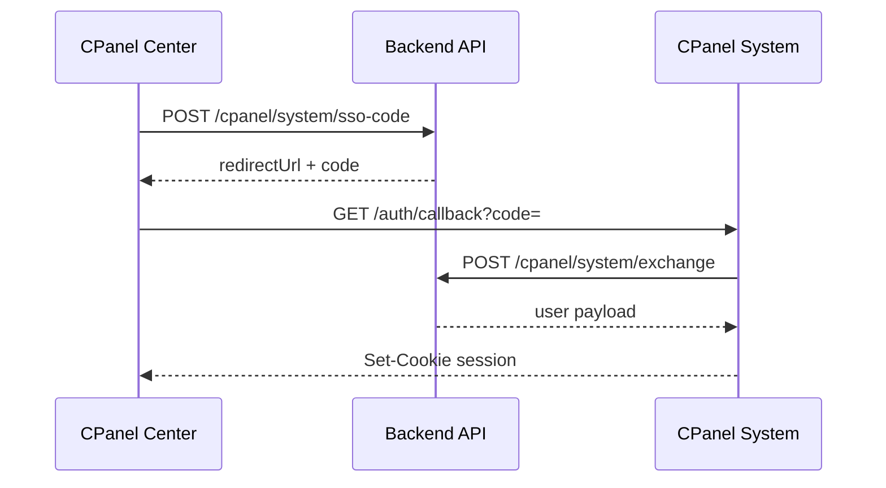
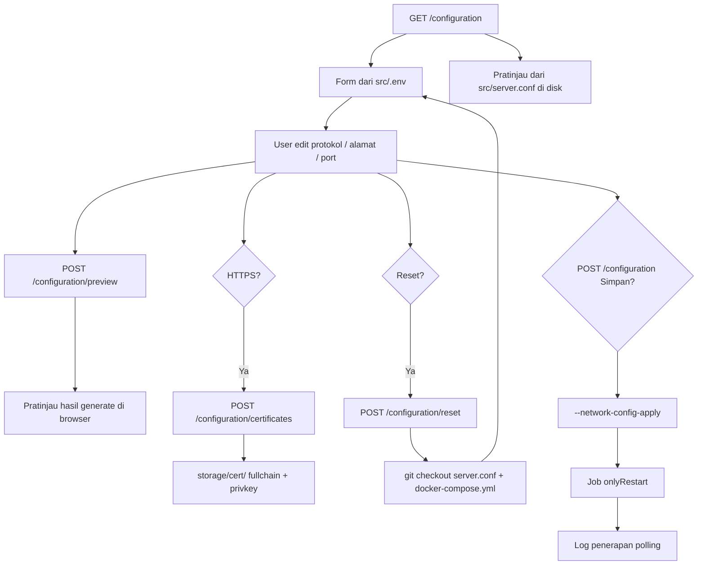
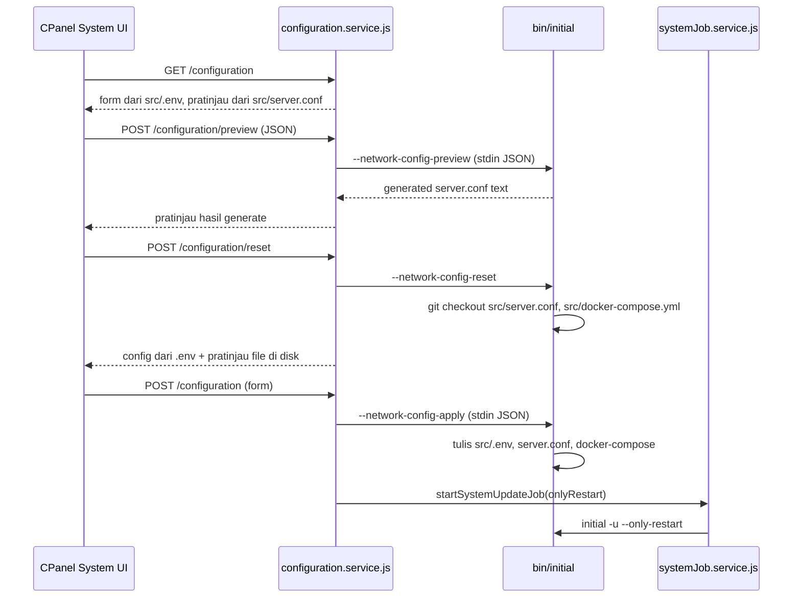

# Speak-Hospital CPanel Center dan CPanel System

Arsitektur, autentikasi, pembaruan, backup/restore, dan registry mirror.

---

## Daftar Isi

### Alur

1. [Deploy ke Production](#deploy-ke-production)
   - [Repositori aplikasi (BE, FE, CPanel System)](#repositori-aplikasi-be-fe-cpanel-system)
   - [Repositori configuration](#repositori-configuration)
   - [Conventional commit](#conventional-commit)
   - [Update image di server](#update-image-di-server)
2. [Instalasi dan Update Server](#instalasi-dan-update-server)
3. [Pembuatan Tenant](#pembuatan-tenant)
4. [Backup dan Restore](#backup-dan-restore)

### Referensi

5. [Arsitektur Infrastruktur](#arsitektur-infrastruktur)
6. [CPanel Center](#cpanel-center)
7. [CPanel System](#cpanel-system)
8. [Autentikasi dan SSO](#autentikasi-dan-sso)
9. [Script initial -u](#script-initial--u)
10. [Konfigurasi jaringan (CPanel System)](#konfigurasi-jaringan-cpanel-system)
11. [File Secret](#file-secret)
12. [Registry Mirror](#registry-mirror)
13. [Referensi File](#referensi-file)

---

## Deploy ke Production

Release Speak-Hospital dilakukan lewat merge Pull Request di GitHub. Setelah merge, pipeline CD (Continuous Delivery) membangun image Docker untuk repo aplikasi. Repo configuration di-promote antar branch lalu di-pull di server saat update.



### Repositori aplikasi (BE, FE, CPanel System)

| Repo | Branch development | Branch production | Image production |
|------|-------------------|-------------------|------------------|
| `speak-hospital-be` | `next-dev` | `0.4.0` | `itlamkprs/backend:0.4-latest` |
| `speak-hospital-fe` | `next-dev` | `0.4.0` | `itlamkprs/frontend:0.4-latest` |
| `_speak-hospital-cpanel` | `next-dev` | `0.4.0` | `itlamkprs/cpanel:0.4-latest` |

**Langkah release (ulangi per repo jika ada perubahan):**

1. Kembangkan dan push ke branch **`next-dev`**. Workflow CD otomatis membangun image `next-dev-latest`.
2. Pastikan workflow GitHub Actions sukses (tab **Actions** di repo).
3. Buat Pull Request di GitHub: **base** `0.4.0` ← **compare** `next-dev`.
4. Review dan merge PR. Gunakan judul merge commit berformat **conventional commit** (lihat bagian berikut).
5. Merge = **push** ke branch `0.4.0` → CD otomatis membangun dan push:
   - `itlamkprs/<service>:<version>` (versi dari `package.json`)
   - `itlamkprs/<service>:0.4-latest`
6. Lanjut ke [Update image di server](#update-image-di-server).

Push ke `next-dev` saja membangun tag development:

| Branch | Tag Docker (contoh backend) |
|--------|----------------------------|
| `next-dev` | `itlamkprs/backend:next-dev-latest`, `itlamkprs/backend:next-dev-<version>` |
| `0.4.0` | `itlamkprs/backend:0.4-latest`, `itlamkprs/backend:<version>` |

Workflow CD: `.github/workflows/cd.yml` di masing-masing repo.

### Repositori configuration

Repo `_speak-hospital-configuration` **tidak** memiliki pipeline CD Docker. Perubahan di-deploy lewat **git pull** saat `initial -u` di server.

| Tahap | Branch | Keterangan |
|-------|--------|------------|
| Development | `0.451.0_next-dev` | Pengembangan script `bin/initial`, nginx, compose |
| Staging release | `0.451.0` | Promosi dari development |
| Production | `0.45.0` | Branch legacy yang di-pull server production |

**Mengapa branch `0.45.0` tetap ada?**

Nama branch ini adalah **legacy** — server production yang sudah terpasang dikonfigurasi menarik (`git pull`) dari `0.45.0`, bukan `0.451.0`. Mengganti nama branch production berarti mengubah konfigurasi git di setiap server. Branch `0.45.0` dipertahankan agar deployment lama tetap kompatibel; isinya diselaraskan otomatis dari `0.451.0` lewat CI/CD.

**Langkah release configuration:**

1. Kembangkan di branch **`0.451.0_next-dev`**, commit dengan conventional commit.
2. Buat PR: **base** `0.451.0` ← **compare** `0.451.0_next-dev` → merge.
3. Setelah merge ke `0.451.0`, workflow **Configuration CD** otomatis merge `0.451.0` → `0.45.0` (tidak perlu PR manual).
4. Di server production, jalankan update (CPanel System → Pemeliharaan → **Update Production**, atau `initial -u --mode-production`) agar `git pull` mengambil branch `0.45.0`.

Workflow CD configuration: `_speak-hospital-configuration/.github/workflows/cd.yml` — trigger pada push ke branch `0.451.0`.

### Conventional commit

Format:

```
<type>(<scope>): <deskripsi singkat>
```

| Type | Pemakaian |
|------|-----------|
| `feat` | Fitur baru |
| `fix` | Perbaikan bug |
| `chore` | Maintenance, release, tooling |
| `docs` | Dokumentasi |
| `refactor` | Refactor tanpa ubah perilaku |
| `test` | Test |

**Contoh commit saat development:**

```
feat(cpanel): tambah backup restore zip
fix(tenant): validasi slug duplikat
chore(deps): bump express ke 4.21
```

**Contoh judul merge commit saat release:**

```
chore(release): merge next-dev into 0.4.0
```

```
chore(release): merge 0.451.0_next-dev into 0.451.0
```

Judul merge commit `0.451.0` → `0.45.0` dibuat otomatis oleh CI:

```
chore(release): merge 0.451.0 into 0.45.0
```

Saat merge PR ke `0.451.0` di GitHub, isi judul merge commit dengan format di atas (bukan default "Merge pull request #123" kecuali disesuaikan).

### Update image di server

Setelah image production ter-push ke Docker Hub:

1. Login **CPanel System** (`/cpanel-system`).
2. Buka **Pemeliharaan**.
3. Jalankan **Update Production** (`--mode-production` → image `:0.4-latest`).
4. Pantau job hingga selesai.

Centang **Termasuk pembaruan CPanel System** jika image `itlamkprs/cpanel` ikut berubah.

Tanpa centang tersebut, container `codebase_cpanel` tidak di-restart (hanya sync `.env`); stack aplikasi tetap di-update.

---

## Instalasi dan Update Server

### Instalasi awal (CLI)

```
ssh -p 2222 sa@localhost initial -u
```

Script: `_speak-hospital-configuration/bin/initial`.

### Update dari CPanel System GUI

`systemJob.service.js` → `initialRunner.js` → `hostInitialRunner.service.js`.

1. Login CPanel System → **Pemeliharaan**.
2. Jalankan **Pembaruan sistem** (selalu `--mode-production` → image `:0.4-latest`).
3. Pantau job di halaman job / stream SSE.

Mode development tidak tersedia di UI. Switch mode lewat SSH:

```bash
initial -u --mode-production
initial -u --mode-development
```

| Cara | Flag | Image tag |
|------|------|-----------|
| UI **Pembaruan sistem** / CLI | `--mode-production` | `:0.4-latest` |
| CLI saja | `--mode-development` | `:next-dev-latest` |

- `INITIAL_USE_HOST=true`: Alpine chroot ke host, jalankan sebagai user `INITIAL_RUN_AS_USER` (bukan root).
- Output job: `storage/cpanel-system/jobs/<id>.json`, `<id>.final.json`.

### Alur internal `initial -u`

| Step | Proses |
|------|--------|
| 1 | Preflight internet (HTTPS 443, DNS 53; skip: `--skip-internet-check`) |
| 2 | Sync referensi image (mirror jika aktif) |
| 3 | Git pull (jika repo git) |
| 4 | Naikkan storage (memory + MariaDB) |
| 5 | Update backend (pull, recreate container/volume) |
| 6 | Update frontend (pull, recreate container/volume) |
| 7 | Naikkan nginx / src stack |
| 8 | Migrate & seed database |
| 9 | Final: update CPanel System (`ensure_cpanel_service`) |

---

## Pembuatan Tenant

1. `POST /api/cpanel/tenants/create` → job `cpanel.tenant.create`.
2. Backend menjalankan `provisionTenant` (`cpanel_tenant.service.js`):

| Step | Proses |
|------|--------|
| 1 | Insert `cpanel.tenants` (slug, stored, secret) |
| 2 | Folder filestore `public/{stored}` |
| 3 | Database tenant di MariaDB |
| 4 | `migrate.js {slug}` |
| 5 | `seed.js {slug}` |

Slug: `[a-zA-Z0-9][a-zA-Z0-9_-]*`, unik. URL: `/hospitals/{slug}`.

---

## Backup dan Restore

Implementasi: `_speak-hospital-cpanel/services/recovery.service.js`. Job type: `system.backup`, `system.restore`.

**Backup (urutan):** memory → database → filestore → arsip `.zip`

**Restore (urutan):** ekstrak → memory → database → filestore

Restore menimpa data aktif. Backup dulu sebelum restore.

Download: `GET /cpanel-system/jobs/:id/backup/download` (superadmin).

### Backup (detail)

| Step | Proses |
|------|--------|
| 1 | Memory - `redis-cli SAVE`, salin `storage/redis/` |
| 2 | Database - `mariadb-dump --all-databases` |
| 3 | Filestore - salin `storage/storefile/` |
| 4 | Arsip - `manifest.json` + zip → `storage/cpanel-system/backups/speak-backup-{timestamp}-{jobId}.zip` |

### Restore (detail)

| Step | Proses |
|------|--------|
| 1 | Ekstrak arsip `.zip` |
| 2 | Validasi `manifest.json`, `datastore/all-databases.sql` |
| 3 | Restore memory - stop memory, salin redis, start memory |
| 4 | Restore database - import SQL |
| 5 | Restore filestore - salin ke `storage/storefile/` |

---

## Arsitektur Infrastruktur

Speak-Hospital berjalan sebagai stack Docker yang diorkestrasi script `bin/initial` pada `_speak-hospital-configuration`.

Nginx (`web_server`) menjadi reverse proxy:

| Path | Container | Keterangan |
|------|-----------|------------|
| `/cpanel` | `codebase_frontend` | React SPA (client routing) |
| `/api/*` | `codebase_backend` | Backend API |
| `/cpanel-system/*` | `codebase_cpanel` | Express + EJS |

MariaDB (`database_mysql`) dan Redis (`memory`) dipakai untuk data aplikasi, schema `cpanel`, tenant, cache SSO, dan session revocation. Semua container berbagi jaringan `speak_network`.



### Lokasi konfigurasi

| Komponen | Path |
|----------|------|
| Script instalasi/update | `_speak-hospital-configuration/bin/initial` |
| Nginx template | `_speak-hospital-configuration/src/server.conf` |
| Compose CPanel System | `_speak-hospital-configuration/src/cpanel/docker-compose.yml` |
| CPanel Center (FE) | `speak-hospital-fe/` |
| Backend API | `speak-hospital-be/` |
| CPanel System | `_speak-hospital-cpanel/` |

---

## CPanel Center

React SPA. Route: `speak-hospital-fe/src/config/routes/cpanel.js`.

Autentikasi: JWT di `localStorage` (`token-cpanel`, `central-user`). Request API: prefix `/api/cpanel/*`, header `Authorization: Bearer`.

### Modul dan API

| Modul | Endpoint (contoh) |
|-------|-------------------|
| Auth / Profil | `POST /api/cpanel/auth`, `GET /api/cpanel/auth/me` |
| Dashboard | `GET /api/cpanel/dashboard/summary` |
| Tenant | `GET/POST/PATCH/DELETE /api/cpanel/tenants/*` |
| User | `GET/POST/PATCH/DELETE /api/cpanel/users/*` |
| Log | `GET /api/cpanel/activity/list` |
| Job | `GET /api/cpanel/jobs/show/:id`, `GET /api/cpanel/jobs/stream/:id` |
| Notifikasi | `GET /api/cpanel/notifications/list` |
| SSO ke System | `GET /api/cpanel/system/availability`, `POST /api/cpanel/system/sso-code` |

Operasi berat (create/import tenant dan user) di-queue sebagai background job di backend.

---

## CPanel System

Express mount prefix `/cpanel-system` (`_speak-hospital-cpanel/app.js`).

Session cookie: `cpanel_system_session` (httpOnly, path `/cpanel-system`).

### Modul dan route

| Modul | Route (contoh) |
|-------|----------------|
| Health | `GET /cpanel-system/health` |
| Login lokal | `GET/POST /cpanel-system/login` |
| SSO callback | `GET /cpanel-system/auth/callback` |
| SSO ke Center | `GET /cpanel-system/auth/to-cpanel` |
| Dashboard | `GET /cpanel-system/dashboard`, `GET .../dashboard/status` |
| Log container | `GET /cpanel-system/logs/:container/json`, `.../stream` (SSE) |
| Maintenance | `POST /cpanel-system/maintenance`, `POST .../maintenance/restore` |
| Konfigurasi | `GET/POST /cpanel-system/configuration`, `POST .../configuration/preview`, `POST .../configuration/reset`, `POST .../configuration/certificates` |
| Job | `GET /cpanel-system/jobs/:id`, `.../json`, `.../stream` |
| Akun | `GET/POST /cpanel-system/account` |

Container `codebase_cpanel` mount `/var/run/docker.sock` (inspect/log container) dan repo ke `/var/www/speak-hospital` (menjalankan `bin/initial` di host).

Nginx: `proxy_buffering off`, timeout 3600s untuk `/cpanel-system/` (job dan SSE).

---

## Autentikasi dan SSO

### CPanel Center

- Login: `POST /api/cpanel/auth` → validasi `cpanel.users` → JWT (~10 jam).
- Middleware: `cpanelAuthMiddleware` pada route `/api/cpanel/*` (setelah route publik).
- Superuser default: `speak-hospital-be/database/cpanel/seeder.js` (username `sa`, password `Qwerty123#`).

### CPanel System (login lokal)

- `POST /cpanel-system/login` → kredensial dari environment atau `storage/cpanel-system/credentials.json`.
- User lokal: id `cpanel-system-local`, role superadmin.

### SSO bidirectional

One-time code TTL ~60 detik di Redis (memory-cache backend). Header rahasia: `X-Cpanel-System-Secret` (`CPANEL_SYSTEM_SECRET`).

**Center → System**

1. `POST /api/cpanel/system/sso-code` (JWT)
2. Backend → redirect `/cpanel-system/auth/callback?code=...`
3. System → `POST /api/cpanel/system/exchange { code }` → session cookie

**System → Center**

1. `POST /api/cpanel/system/create-code-from-system { userId, next }`
2. Redirect `/cpanel/sso?code=...&next=/cpanel/dashboard`
3. Frontend → `POST /api/cpanel/auth/sso { code }` → JWT

### Logout silang

| Dari | Aksi |
|------|------|
| Center | `POST /api/cpanel/system/logout` + `/cpanel-system/auth/logout` |
| System | `POST /api/cpanel/system/logout-by-system` |
| Backend | Tandai `userId` revoked di cache |



Implementasi: `speak-hospital-be/apps/services/cpanel_system_sso.service.js`, `_speak-hospital-cpanel/services/ssoClient.js`.

---

## Script `initial -u`

### Flag CLI

| Flag | Efek |
|------|------|
| `--mode-production` | Image tag `0.4-latest` |
| `--mode-development` | Image tag `next-dev-latest`; mirror diabaikan |
| `--only-restart` | Restart tanpa pull/cleanup volume |
| `--only-reset` | Reset konfigurasi web ke HTTP (`src/.env`, `server.conf`, `docker-compose.yml`), lalu restart container |
| `--include-cpanel-system` | Job dari UI: ikut restart panel |
| `--skip-internet-check` | Lewati preflight |

Konfigurasi HTTP/HTTPS, domain/IP, dan port nginx dilakukan lewat **CPanel System → Konfigurasi** (`/cpanel-system/configuration`).

### Volume CPanel System

Volume `codebase_cpanel:/var/www/codebase/` menyimpan kode app. Saat `ensure_cpanel_service` (bukan `--only-restart`): container + volume dihapus, dibuat ulang dari image terbaru.

---

## Konfigurasi jaringan (CPanel System)

Konfigurasi HTTP/HTTPS, domain/IP, port, dan pratinjau nginx dilakukan lewat GUI CPanel System. Menu **Konfigurasi** berada di sidebar **System**, di atas **Pemeliharaan**.

**URL:** `/cpanel-system/configuration` (superadmin untuk mengubah; role lain dapat melihat read-only)

### UI (satu halaman)

Form tunggal: protokol, alamat, port, sertifikat SSL (jika HTTPS), pratinjau, lalu Simpan / Reset / Batal. Log penerapan dan riwayat job tampil di bawah form.

| Elemen | Fungsi |
|--------|--------|
| Tombol HTTP / HTTPS / HTTP + HTTPS | Pilih mode protokol |
| Alamat server | `SERVER_NAME` di `src/.env` (`_` = semua host) |
| Port HTTP / HTTPS | `PORT` / `SECURE_PORT` di `src/.env` |
| Kartu **Sertifikat SSL** | Tampil jika HTTPS; upload file `.pem` (disimpan ke `storage/cert/`) |
| Tombol **Unggah sertifikat** | `POST /configuration/certificates` — simpan file tanpa job penerapan |
| Tombol **Reset** | `POST /configuration/reset` — `git checkout` `src/server.conf` + `src/docker-compose.yml`; form diisi ulang dari `src/.env`; pratinjau dari file di disk |
| Tombol **Batal** | Kembali ke Pemeliharaan (konfirmasi modal) |
| Pratinjau konfigurasi web | `<pre>` readonly; awal dari file `src/server.conf`; saat edit form diperbarui via `POST /configuration/preview` |
| Panel **Log penerapan** | Polling job `onlyRestart` inline (pola Pemeliharaan) |
| Simpan | `POST /configuration` → apply + job `initial -u --only-restart` |

Semua aksi ubah (Simpan, Unggah, Reset, Batal) memakai konfirmasi modal. Form dinonaktifkan saat ada job berjalan.

Non-superadmin: halaman dapat dibuka (read-only) dengan peringatan flash; POST ditolak.

### Alur pengguna (UI)



| Aksi UI | Route | Efek |
|---------|-------|------|
| Buka halaman | `GET /configuration` | Form + pratinjau disk |
| Edit form | `POST /configuration/preview` | Pratinjau generate (belum tulis file) |
| Unggah sertifikat | `POST /configuration/certificates` | Tulis `storage/cert/` |
| Simpan | `POST /configuration` | Apply + job restart |
| Reset | `POST /configuration/reset` | Checkout file + reload form/pratinjau |

### Alur backend



### Payload JSON ke `initial`

| Field | Nilai |
|-------|--------|
| `protocol` | `http`, `https`, `http_https` |
| `serverAddress` | IP, domain, atau `_` |
| `httpPort` | Port HTTP (jika relevan) |
| `httpsPort` | Port HTTPS (jika relevan) |

### Flag `initial` (konfigurasi jaringan)

| Flag | Efek |
|------|------|
| `--network-config-preview` | Generate teks `server.conf` dari JSON stdin (tanpa menulis file) |
| `--network-config-apply` | Tulis `src/.env`, `server.conf`, patch `docker-compose.yml` |
| `--network-config-reset` | Reset ke HTTP: `git checkout` `src/server.conf` + `src/docker-compose.yml`, tulis ulang flag jaringan di `src/.env`, hapus mount SSL di compose |

Fungsi Python di `bin/initial`: `preview_network_configuration()`, `apply_network_configuration()`, `reset_network_configuration()`.

Sertifikat SSL hanya diunggah lewat UI ke `storage/cert/` (`fullchain.pem`, `privkey.pem`). Mode HTTPS memerlukan kedua file sebelum **Simpan**.

Jika pemasangan SSL/TLS gagal dan layanan tidak bisa diakses, pulihkan lewat SSH:

```bash
initial -u --only-reset
```

Perintah di atas mengembalikan nginx ke HTTP saja, lalu me-restart container (tanpa pull image).

---

## File Secret

Password dan kunci sensitif disimpan di file `.secret`, **bukan** di `.env` atau `.env.example`. File ini di-gitignore dan tidak ikut clone/pull. `initial -u` membacanya lalu mengisi `DB_PASSWORD`, `MM_PASSWORD`, dan secret aplikasi ke `.env` layanan saat update.

### Daftar file

| File | Untuk |
|------|--------|
| `storage/secrets/mysql.secret` | Password MariaDB |
| `storage/secrets/redis.secret` | Password Redis |
| `bin/secrets/secret_key.secret` | `SECRET_KEY` (backend + cpanel) |
| `bin/secrets/cpanel_system_secret.secret` | `CPANEL_SYSTEM_SECRET` |
| `bin/secrets/cpanel_system_password.secret` | Login CPanel System (user default: `sa`) |

Lokasi lama `storage/mysql/.secret` dan `storage/redis/.secret` otomatis dimigrasi ke `storage/secrets/` saat `initial -u`. Secret disimpan di luar folder data MariaDB/Redis agar tidak bentrok dengan ownership container.

### Ownership folder data (Docker)

`storage/mysql/` dan `storage/redis/` adalah **bind mount data** container. Owner di host (mis. `cwagent`, `999:999`) ditentukan proses di dalam container, **bukan** user yang menjalankan `initial`. Ini normal.

| Folder | Siapa yang akses | Catatan |
|--------|------------------|---------|
| `storage/mysql/`, `storage/redis/` | Container MariaDB/Redis | Host user tidak perlu `ls` atau `chown` ke sini |
| `storage/secrets/` | User host (`sa`, dll.) | Password disimpan di sini |
| `bin/secrets/` | User host | Secret aplikasi |

Jangan `chown -R` isi `storage/mysql/` ke user host - dapat merusak database. Cukup pastikan `storage/secrets/*.secret` ada dan bisa dibaca user `initial`.

Fungsi di `bin/initial`: `setup_storage_secrets()`, `setup_bin_secrets()`, `get_app_secrets()`.

### Instalasi baru

Jalankan `initial -u`. Step 2 (setup environment) membuat semua file di atas secara otomatis. Password login CPanel System (`sa / ...`) dicetak di terminal saat pertama kali dibuat.

### Pembuatan manual

Gunakan jika restore dari backup atau file secret hilang. Nilai di bawah ini sesuai default lama di `.env` / `.env.example` (sebelum dipindah ke `.secret`):

| File secret | Dulu di `.env` | Nilai default |
|-------------|----------------|---------------|
| `storage/secrets/mysql.secret` | `DB_PASSWORD` (`src/backend/.env`) | `Lamkprs2727#` |
| `storage/secrets/redis.secret` | `MM_PASSWORD` (`src/backend/.env`) | `Lamkprs2727#` |
| `bin/secrets/secret_key.secret` | `SECRET_KEY` | `Lamkprs2727#` |
| `bin/secrets/cpanel_system_secret.secret` | `CPANEL_SYSTEM_SECRET` (`bin/.env`) | `Lamkprs2727#` |
| `bin/secrets/cpanel_system_password.secret` | `CPANEL_SYSTEM_PASSWORD` (`bin/.env`) | `Qwerty123#` |

Jalankan dari root proyek Speak-Hospital:

```bash
# Storage (dulu DB_PASSWORD / MM_PASSWORD)
mkdir -p storage/secrets
echo -n 'Lamkprs2727#' > storage/secrets/mysql.secret
echo -n 'Lamkprs2727#' > storage/secrets/redis.secret

# Aplikasi (dulu SECRET_KEY, CPANEL_SYSTEM_SECRET, CPANEL_SYSTEM_PASSWORD)
mkdir -p bin/secrets
echo -n 'Lamkprs2727#' > bin/secrets/secret_key.secret
echo -n 'Lamkprs2727#' > bin/secrets/cpanel_system_secret.secret
echo -n 'Qwerty123#' > bin/secrets/cpanel_system_password.secret

chmod 700 storage/secrets
chmod 600 storage/secrets/*.secret bin/secrets/*.secret
initial -u
```

### Permission denied

Hanya `storage/secrets/` dan `bin/secrets/` yang harus bisa dibaca user `initial`. `Permission denied` saat `ls storage/mysql/` **bukan masalah** selama secret ada di `storage/secrets/`.

```bash
mkdir -p storage/secrets bin/secrets
# ... isi secret (lihat tabel di atas)
chmod 700 storage/secrets
chmod 600 storage/secrets/*.secret bin/secrets/*.secret
initial -u
```

Jika server sudah pernah di-install dengan password lain, pakai nilai dari backup - jangan pakai default di atas. Untuk MariaDB/Redis yang sudah punya data, **jangan** generate password baru.

### Migrasi dari `.env` lama

Jika secret masih ada di `bin/.env`, `src/cpanel/.env`, atau `src/backend/.env`, jalankan `initial -u`. Nilai lama dipindahkan ke file `.secret` dan dihapus dari `bin/.env`.

---

## Registry Mirror

Aktif jika `DOCKER_REGISTRY_MIRROR=mirror.gcr.io` di `bin/.env`.

| Asal | Setelah mirror |
|------|----------------|
| `itlamkprs/backend:0.4-latest` | `mirror.gcr.io/itlamkprs/backend:0.4-latest` |
| `redis:7.2.4` | `mirror.gcr.io/library/redis:7.2.4` |
| `ghcr.io/joeferner/redis-commander:latest` | Tidak di-mirror |

Fungsi: `apply_registry_mirror()` di `bin/initial`. Mode development mengabaikan mirror.

---

## Referensi File

| Topik | File |
|-------|------|
| Initial script | `_speak-hospital-configuration/bin/initial` |
| Storage secrets | `storage/secrets/mysql.secret`, `storage/secrets/redis.secret` |
| App secrets | `bin/secrets/*.secret` |
| CD backend | `speak-hospital-be/.github/workflows/cd.yml` |
| CD frontend | `speak-hospital-fe/.github/workflows/cd.yml` |
| CD CPanel System | `_speak-hospital-cpanel/.github/workflows/cd.yml` |
| CD configuration | `_speak-hospital-configuration/.github/workflows/cd.yml` |
| Nginx | `_speak-hospital-configuration/src/server.conf` |
| SSO backend | `speak-hospital-be/apps/services/cpanel_system_sso.service.js` |
| SSO System client | `_speak-hospital-cpanel/services/ssoClient.js` |
| Konfigurasi jaringan | `_speak-hospital-cpanel/routes/configuration.js`, `services/configuration.service.js`, `middleware/sslCertUpload.js` |
| System jobs | `_speak-hospital-cpanel/services/systemJob.service.js` |
| Backup/restore | `_speak-hospital-cpanel/services/recovery.service.js` |
| Tenant provision | `speak-hospital-be/apps/services/cpanel_tenant.service.js` |
| CPanel FE routes | `speak-hospital-fe/src/config/routes/cpanel.js` |

---

*Author: LAM-KPRS · info.lamkprs@gmail.com*
