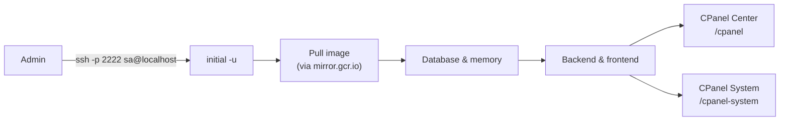
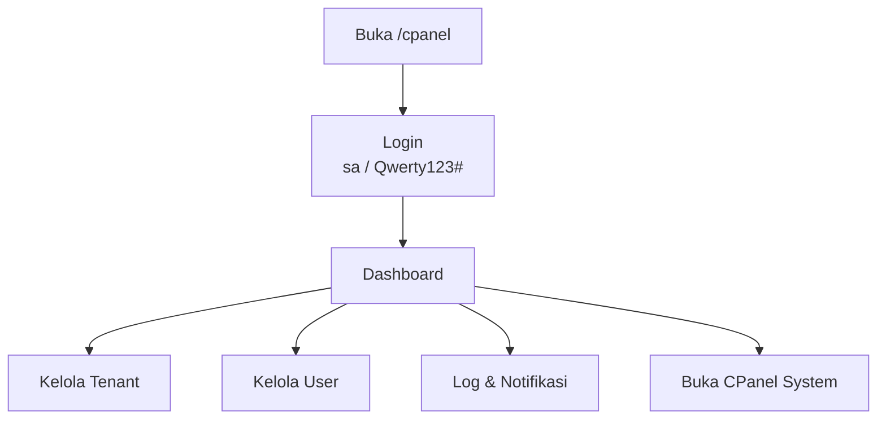
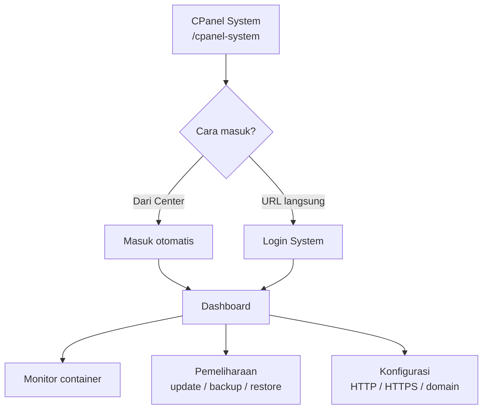
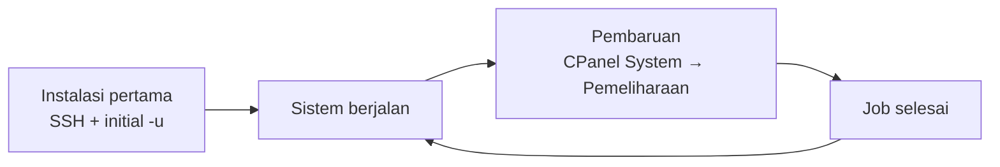
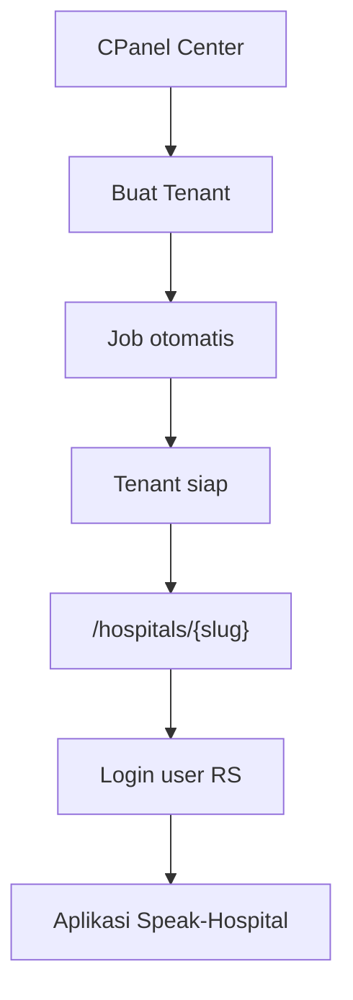
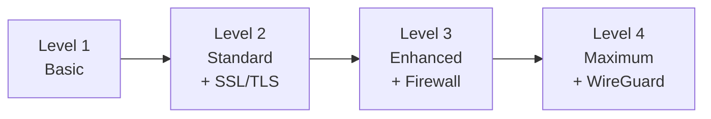
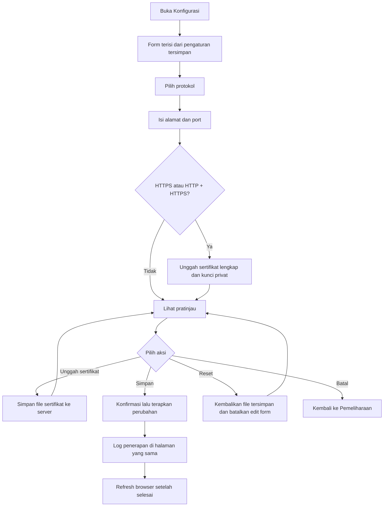

# Speak-Hospital CPanel Center dan CPanel System

Alur instalasi, panel administrasi, tenant, dan pembaruan sistem.

---

## Daftar Isi

### Alur

1. [Instalasi Awal](#instalasi-awal)
2. [CPanel Center](#cpanel-center)
   - [Modul](#modul)
3. [CPanel System](#cpanel-system)
   - [Modul](#modul-1)
4. [Pembaruan Setelah Instalasi](#pembaruan-setelah-instalasi)
5. [Pembuatan dan Kunjungan Tenant](#pembuatan-dan-kunjungan-tenant)
   - [Membuat tenant](#membuat-tenant)
   - [Mengunjungi tenant](#mengunjungi-tenant)
6. [Penutup](#penutup)

### Referensi

7. [Level Keamanan](#level-keamanan)
8. [Prasyarat Jaringan](#prasyarat-jaringan)
9. [Konfigurasi IP Address](#konfigurasi-ip-address)
10. [Setup Domain dan SSL/TLS](#setup-domain-dan-ssltls)
11. [WireGuard VPN](#wireguard-vpn)

---

## Pendahuluan

Speak-Hospital menyediakan dua antarmuka administrasi yang saling terhubung.

**CPanel Center** (`/cpanel`) digunakan untuk pengelolaan administratif: tenant, pengguna, log aktivitas, dan notifikasi.

**CPanel System** (`/cpanel-system`) digunakan untuk pengelolaan operasional server: pemantauan container, pembaruan aplikasi, restart layanan, backup, dan restore.

Instalasi pertama dilakukan sekali melalui SSH. Setelah sistem berjalan, pembaruan berikutnya dilakukan melalui CPanel System tanpa perlu SSH lagi.

---

## Instalasi Awal

Instalasi pertama dilakukan dari komputer admin melalui SSH. Admin tidak perlu masuk ke server secara manual; cukup menjalankan perintah berikut:

```
ssh -p 2222 sa@localhost initial -u
```

| Item | Nilai |
|------|-------|
| User SSH | `sa` |
| Password | `Qwerty123#` |

Password SSH sama dengan akun login CPanel Center.

Perintah `initial -u` menyiapkan seluruh infrastruktur Speak-Hospital: menarik image container, menjalankan database dan memory store, lalu mengaktifkan backend, frontend, web server, CPanel Center, dan CPanel System. Proses ini cukup dilakukan **sekali**. Tunggu hingga selesai sebelum melanjutkan.

Setelah instalasi, konfigurasi jaringan lanjutan (IP static, domain, SSL/TLS, firewall, VPN) disesuaikan dengan **level keamanan** yang dipilih. Lihat bagian [Level Keamanan](#level-keamanan).

Saat menarik image, sistem dapat menggunakan registry mirror. Image Docker Hub diarahkan melalui `mirror.gcr.io`, misalnya `mirror.gcr.io/itlamkprs/...` untuk image aplikasi dan `mirror.gcr.io/library/...` untuk image standar seperti redis dan mariadb.



---

## CPanel Center

Setelah instalasi selesai, buka browser dan akses **`/cpanel`**.

| Item | Nilai |
|------|-------|
| URL | `/cpanel` |
| User | `sa` |
| Password | `Qwerty123#` |

Setelah login berhasil, admin diarahkan ke dashboard CPanel Center.

### Modul

| Modul | Fungsi |
|-------|--------|
| Dashboard | Ringkasan kondisi sistem |
| Tenant | Buat, ubah, hapus, import, export tenant; setiap tenant di `/hospitals/{slug}` |
| User | Kelola pengguna CPanel Center dan pengguna rumah sakit per tenant |
| Log | Riwayat aktivitas administratif |
| Notifikasi | Status job dan peristiwa penting |
| Profil | Ubah profil dan avatar |
| CPanel System | Buka panel operasional server (jika tersedia) |



---

## CPanel System

CPanel System diakses melalui **`/cpanel-system`**. Panel ini dipakai untuk memantau container, melihat log layanan, dan menjalankan operasi maintenance.

Admin dapat masuk dengan dua cara:

1. Dari CPanel Center melalui menu CPanel System - masuk otomatis tanpa login ulang.
2. Buka langsung `/cpanel-system` - login dengan kredensial khusus CPanel System.

Kredensial login lokal CPanel System **berbeda** dari akun CPanel Center. Default instalasi: `sa` / `Qwerty123#` (dari `CPANEL_SYSTEM_USERNAME` / `CPANEL_SYSTEM_PASSWORD`).

Jika login langsung ke `/cpanel-system` gagal (password sudah diganti atau tidak diketahui):

1. Login dulu ke **CPanel Center** (`/cpanel`) dengan akun Center (mis. `sa` / `Qwerty123#`).
2. Buka **CPanel System** dari sidebar/menu Center — masuk otomatis lewat SSO, tanpa password System.
3. Di CPanel System, buka menu **Akun**, lalu ubah username/password login lokal sesuai kebutuhan.
4. Setelah itu, login langsung ke `/cpanel-system` bisa memakai kredensial baru tersebut.

### Modul

| Modul | Fungsi |
|-------|--------|
| Dashboard | Status container dan log live (backend, frontend, web server, database, memory) |
| Konfigurasi | HTTP/HTTPS, domain/IP, port, pratinjau pengaturan web, terapkan ke layanan web |
| Pemeliharaan | Restart, update Production/Development, backup, restore, pantau job |
| Akun | Kelola kredensial login lokal (superadmin) |
| CPanel Center | Tombol kembali ke `/cpanel` tanpa login ulang |



---

## Pembaruan Setelah Instalasi

Setelah instalasi awal lewat SSH, **semua pembaruan berikutnya dilakukan melalui CPanel System**, bukan lewat terminal.

**Alur pembaruan production:**

1. Tim pengembangan menyelesaikan release (merge ke branch production di GitHub).
2. Login ke **CPanel System**.
3. Buka halaman **Pemeliharaan**.
4. Jalankan **Pembaruan sistem** (atau restart / backup / restore sesuai kebutuhan).
5. Pantau job hingga selesai.

Di UI CPanel System hanya ada **Pembaruan sistem** (production, image `:0.4-latest`). Untuk beralih ke development (`:next-dev-latest`) atau production lewat terminal, gunakan `initial -u`:

```bash
ssh -p 2222 sa@localhost initial -u --mode-production
ssh -p 2222 sa@localhost initial -u --mode-development
```

Secara default, CPanel System tidak ikut di-restart saat update agar proses job tidak terputus. Centang **Termasuk pembaruan CPanel System** jika panel ikut perlu diperbarui.



---

## Pembuatan dan Kunjungan Tenant

### Membuat tenant

1. Login ke CPanel Center.
2. Buka menu **Tenant** → **Tambah Tenant**.
3. Isi **slug** (contoh: `rsud-jakarta`) dan **deskripsi**.
4. Simpan - sistem menjalankan job pembuatan otomatis.
5. Pantau job hingga selesai (notifikasi atau halaman job).

### Mengunjungi tenant

Setelah tenant siap, aplikasi rumah sakit diakses di:

```
http://alamat-server/hospitals/{slug}
```

Contoh: `http://192.168.1.100/hospitals/rsud-jakarta`

Pengguna rumah sakit login dengan akun tenant yang dibuat lewat menu **User** di CPanel Center.



---

## Penutup

Speak-Hospital memisahkan peran administratif dan operasional. CPanel Center mengelola tenant dan pengguna; CPanel System mengelola infrastruktur dan pembaruan.

Instalasi pertama: `ssh -p 2222 sa@localhost initial -u` (sekali). Operasional harian lewat browser: login Center → kelola tenant/user → arahkan pengguna ke `/hospitals/{slug}` → pembaruan server lewat CPanel System.

---

## Level Keamanan

Speak-Hospital mendukung empat level keamanan jaringan. Setiap level menambah lapisan proteksi di atas level sebelumnya. Pilih level sesuai kebutuhan rumah sakit dan kebijakan IT.

| Level | Nama | Ringkasan | Konfigurasi utama |
|-------|------|-----------|-------------------|
| 1 | Basic Security | Instalasi dasar, HTTP, IP dynamic | `initial -u` |
| 2 | Standard Security | HTTPS + sertifikat SSL/TLS, domain/IP tetap | CPanel System → **Konfigurasi** |
| 3 | Enhanced Security | Level 2 + firewall host (UFW) | UFW rules |
| 4 | Maximum Security | Level 3 + WireGuard VPN Biznet ↔ Office | WireGuard |



### Level 1: Basic Security

Level default setelah `initial -u` selesai.

| Aspek | Konfigurasi |
|-------|-------------|
| Protokol | HTTP (port 80) |
| IP address | Dynamic (DHCP) |
| Sertifikat SSL/TLS | Tidak digunakan |
| Firewall host | Tidak wajib |
| WireGuard VPN | Tidak digunakan |

Cocok untuk lingkungan uji coba atau jaringan internal tertutup tanpa akses internet publik ke aplikasi.

### Level 2: Standard Security

Menambahkan enkripsi HTTPS dan alamat server tetap (domain atau IP static).

| Aspek | Konfigurasi |
|-------|-------------|
| Protokol | HTTPS (port 443), opsional redirect HTTP → HTTPS |
| IP address | **IP Static** disarankan |
| Sertifikat SSL/TLS | Wajib (`fullchain.pem`, `privkey.pem`) |
| Domain | Disarankan (mis. `speak.rsud.example.com`) |
| WireGuard VPN | Tidak digunakan |

**Langkah:**

1. Selesaikan `initial -u`.
2. Atur IP Static jika belum (lihat [Konfigurasi IP Address](#konfigurasi-ip-address)).
3. Login **CPanel System** → **Konfigurasi** untuk setup domain dan SSL/TLS (lihat [Setup Domain dan SSL/TLS](#setup-domain-dan-ssltls)).

### Level 3: Enhanced Security

Menambahkan firewall host untuk membatasi port yang terbuka.

| Aspek | Konfigurasi |
|-------|-------------|
| Dasar | Semua persyaratan Level 2 |
| Firewall | UFW aktif, hanya port yang diperlukan |

**Contoh aturan UFW:**

```bash
sudo ufw default deny incoming
sudo ufw default allow outgoing
sudo ufw allow 80/tcp comment 'HTTP'
sudo ufw allow 443/tcp comment 'HTTPS'
sudo ufw allow 2222/tcp comment 'SSH Admin'
sudo ufw enable
sudo ufw status
```

Sesuaikan port jika HTTP/HTTPS memakai port kustom dari halaman **Konfigurasi** di CPanel System.

WireGuard **belum** diperlukan di level ini.

### Level 4: Maximum Security

Level tertinggi. Menambahkan tunnel WireGuard untuk komunikasi aman antara **Biznet Server** (server production) dan **Office Server** (kantor/admin).

| Aspek | Konfigurasi |
|-------|-------------|
| Dasar | Semua persyaratan Level 3 |
| WireGuard VPN | **Wajib** - isolasi jaringan tambahan |

WireGuard **hanya diperlukan** untuk Level 4. Untuk level 1-3, WireGuard tidak wajib.

Langkah konfigurasi WireGuard: lihat [WireGuard VPN](#wireguard-vpn).

---

## Prasyarat Jaringan

Pastikan firewall atau router mengizinkan **akses keluar** ke host dan port berikut sebelum instalasi atau update (`initial -u`).

### Whitelist wajib

| Host / domain | Port | Protokol |
|---------------|------|----------|
| `registry-1.docker.io` | 443 | TCP (HTTPS) |
| `auth.docker.io` | 443 | TCP (HTTPS) |
| `production.cloudflare.docker.com` | 443 | TCP (HTTPS) |
| `production.cloudfront.docker.com` | 443 | TCP (HTTPS) |
| `ghcr.io` | 443 | TCP (HTTPS) |
| `pkg-containers.githubusercontent.com` | 443 | TCP (HTTPS) |
| `registry.npmjs.org` | 443 | TCP (HTTPS) |
| `github.com` | 22 | TCP (SSH) |
| `gitlab.com` | 22 | TCP (SSH) |
| Resolver DNS | 53 | TCP & UDP |

### Whitelist opsional

| Host / domain | Port | Protokol | Kapan |
|---------------|------|----------|-------|
| `mirror.gcr.io` | 443 | TCP (HTTPS) | Jika `DOCKER_REGISTRY_MIRROR=mirror.gcr.io` di `bin/.env` |
| `ssh.github.com` | 443 | TCP (SSH) | Alternatif GitHub jika port 22 diblokir |
| `pypi.org` | 443 | TCP (HTTPS) | Dependensi Python |
| `files.pythonhosted.org` | 443 | TCP (HTTPS) | Dependensi Python |
| *(peer VPN)* | 51820 | UDP | Level 4 - WireGuard (lihat [WireGuard VPN](#wireguard-vpn)) |

---

## Konfigurasi IP Address

Konfigurasi IP address dapat dilakukan dengan dua cara: **IP Dynamic (default)** atau **IP Static**. Secara default, sistem menggunakan IP Dynamic yang diperoleh dari DHCP server.

### 1. Cek konfigurasi IP saat ini

Untuk melihat konfigurasi IP address yang sedang aktif:

```bash
ip a
```

Perintah ini menampilkan semua interface jaringan beserta IP address, subnet mask, dan informasi lainnya.

### 2. IP Dynamic (default)

Secara default, sistem menggunakan IP Dynamic yang diperoleh dari DHCP server. Konfigurasi ini tidak memerlukan pengaturan manual dan IP address otomatis diperoleh saat boot atau saat interface jaringan diaktifkan.

| Keuntungan | Keterangan |
|------------|------------|
| Tanpa konfigurasi manual | Plug-and-play via DHCP |
| Otomatis saat boot | IP diperoleh ulang saat restart |
| Cocok untuk IP yang boleh berubah | Lingkungan lab / uji coba |

### 3. Setup IP Static

Gunakan IP Static jika server harus memiliki alamat tetap (disarankan untuk Level 2 ke atas).

#### 3.1. Edit file interfaces

```bash
sudo vi /etc/network/interfaces
```

Contoh konfigurasi:

```ini
# Loopback interface
auto lo
iface lo inet loopback

# Primary network interface (contoh: eth0)
auto eth0
iface eth0 inet static
    address 192.168.1.100
    netmask 255.255.255.0
    gateway 192.168.1.1
    dns-nameservers 8.8.8.8 8.8.4.4
```

| Parameter | Keterangan |
|-----------|------------|
| `auto eth0` | Interface otomatis diaktifkan saat boot |
| `iface eth0 inet static` | IP Static untuk interface eth0 |
| `address` | IP address yang ingin digunakan |
| `netmask` | Subnet mask |
| `gateway` | Gateway / default route |
| `dns-nameservers` | DNS server (opsional, bisa juga di `resolv.conf`) |

#### 3.2. Edit file resolv.conf (opsional)

Jika DNS dikonfigurasi terpisah:

```bash
sudo vi /etc/resolv.conf
```

Contoh:

```ini
nameserver 8.8.8.8
nameserver 8.8.4.4
nameserver 1.1.1.1
```

**Catatan:** Jika DNS sudah diatur lewat `dns-nameservers` di `/etc/network/interfaces`, file `resolv.conf` dapat ditimpa oleh network manager. Gunakan salah satu metode saja.

#### 3.3. Restart networking service

```bash
sudo rc-service networking restart
```

**Penting:** Tunggu beberapa saat hingga proses restart selesai. Interface jaringan dinonaktifkan lalu diaktifkan kembali; koneksi SSH dapat terputus sementara.

**Catatan keamanan:** Jika konfigurasi dilakukan lewat SSH, siapkan akses fisik ke server atau console (KVM/IPMI) sebagai cadangan.

#### 3.4. Verifikasi konfigurasi

```bash
ip a
```

Pastikan IP sesuai konfigurasi di `/etc/network/interfaces`. Uji konektivitas:

```bash
# Test konektivitas ke gateway
ping -c 3 192.168.1.1

# Test DNS resolution
nslookup google.com
```

### 4. Kembali ke IP Dynamic

Edit `/etc/network/interfaces`:

```ini
# Loopback interface
auto lo
iface lo inet loopback

# Primary network interface (contoh: eth0)
auto eth0
iface eth0 inet dhcp
```

Restart networking service:

```bash
sudo rc-service networking restart
```

Tunggu hingga proses restart selesai.

---

## Setup Domain dan SSL/TLS

Konfigurasi domain, protokol HTTP/HTTPS, dan sertifikat SSL/TLS dilakukan setelah `initial -u` selesai. Diperlukan untuk **Level 2: Standard Security** ke atas.

Konfigurasi dilakukan lewat **CPanel System**, bukan terminal.

1. Login **CPanel System** (`/cpanel-system`) sebagai superadmin.
2. Buka menu **System** → **Konfigurasi** (`/cpanel-system/configuration`).

Halaman **Konfigurasi** menampilkan satu form untuk protokol, alamat, port, sertifikat SSL, dan pratinjau sekaligus.

### Alur konfigurasi



| Aksi | File di server | Layanan web |
|------|----------------|-------------|
| Edit form / pratinjau | Belum berubah | Belum berubah |
| Unggah sertifikat | File sertifikat tersimpan | Belum berubah |
| **Simpan** | Pengaturan ditulis | **Diterapkan** (mulai ulang layanan web) |
| **Reset** | File konfigurasi web dikembalikan | Belum berubah |
| Batal | Tidak ada | Tidak ada |

### Pilihan protokol

| Tombol | Keterangan |
|--------|------------|
| **HTTP** | Hanya HTTP (Level 1) |
| **HTTPS** | Hanya HTTPS (Level 2+) |
| **HTTP + HTTPS** | Keduanya; HTTP dialihkan ke HTTPS (Level 2+, disarankan) |

### Field dan tombol

| Elemen | Keterangan |
|--------|------------|
| Alamat server | IP atau domain. Kosongkan atau isi `_` untuk menerima semua alamat akses |
| Port HTTP | Default `80` (muncul jika HTTP aktif) |
| Port HTTPS | Default `443` (muncul jika HTTPS aktif) |
| Sertifikat SSL | Muncul otomatis jika protokol HTTPS atau HTTP + HTTPS; unggah sertifikat lengkap dan kunci privat |
| Pratinjau konfigurasi web | Tampilan readonly; saat halaman dibuka menampilkan pengaturan tersimpan; berubah otomatis saat input diubah |
| **Unggah sertifikat** | Simpan file sertifikat ke server tanpa menerapkan perubahan |
| **Simpan** | Terapkan konfigurasi dan mulai ulang layanan web (dengan konfirmasi) |
| **Reset** | Batalkan perubahan yang belum disimpan; kembalikan file konfigurasi web ke salinan tersimpan di server dan muat ulang pratinjau (dengan konfirmasi). Tidak langsung menerapkan ke layanan yang sedang berjalan |
| **Batal** | Kembali ke Pemeliharaan tanpa menyimpan (dengan konfirmasi) |
| Log penerapan | Catatan proses penerapan tampil di bawah form |

Klik **Simpan** untuk menerapkan perubahan. Progress tampil di panel **Log penerapan** pada halaman yang sama.

Role selain superadmin dapat **melihat** konfigurasi saat ini (read-only) dengan peringatan di halaman.

### Sertifikat SSL/TLS

Jika HTTPS atau HTTP + HTTPS dipilih, bagian **Sertifikat SSL** muncul di form yang sama:

| Unggahan di UI | Keterangan |
|---------------|------------|
| **Sertifikat lengkap** | File rantai sertifikat (biasanya `fullchain.pem` dari CA) |
| **Kunci privat** | File kunci privat (biasanya `privkey.pem` dari CA) |

Klik **Unggah sertifikat** setelah memilih kedua file untuk menyimpan ke server tanpa menerapkan perubahan. Badge **Sertifikat siap** berarti kedua file sudah lengkap di server.

Mode HTTPS memerlukan sertifikat lengkap sebelum **Simpan**.

### Contoh alur HTTPS (Level 2)

1. Pilih **HTTPS** atau **HTTP + HTTPS**
2. Isi domain/IP dan port
3. **Unggah sertifikat** — tunggu badge **Sertifikat siap**
4. Periksa **Pratinjau konfigurasi web**
5. **Simpan** — pantau **Log penerapan** hingga selesai
6. Refresh browser, lalu uji akses dari browser

### Setelah simpan

Sistem menulis pengaturan jaringan ke file konfigurasi di server (`src/.env`, `src/server.conf`, dan penyesuaian `src/docker-compose.yml` jika HTTPS), lalu menjalankan proses penerapan di background (`initial -u --only-restart` sebagai job). Progress tampil di panel **Log penerapan**.

Contoh nilai di `src/.env`:

| Variabel | Contoh |
|----------|--------|
| `SERVER_NAME` | `speak.rsud.example.com` |
| `PORT` | `80` |
| `SECURE_PORT` | `443` |
| `ENABLE_HTTPS` | `true` |
| `REDIRECT_HTTP_TO_HTTPS` | `true` |
| `SSL_CERT_PATH` | path ke `fullchain.pem` |
| `SSL_KEY_PATH` | path ke `privkey.pem` |

Jika proses penerapan otomatis gagal, jalankan manual dari **Pemeliharaan** → **Restart saja**, atau lewat SSH:

```bash
initial -u --only-restart
```

---

## WireGuard VPN

WireGuard VPN merupakan tambahan keamanan untuk **Level 4: Maximum Security**. VPN ini diperlukan untuk komunikasi aman antara Biznet Server dan Office Server, menambahkan lapisan isolasi jaringan tambahan.

WireGuard **hanya diperlukan** jika menggunakan Level 4. Untuk level lainnya, WireGuard tidak diperlukan.

### 1. Konfigurasi WireGuard

**File konfigurasi:** `/etc/wireguard/wg0.conf`

**Contoh konfigurasi server (Biznet):**

```ini
[Interface]
PrivateKey = <SERVER_PRIVATE_KEY>
Address = 10.0.0.1/24
ListenPort = 51820

[Peer]
PublicKey = <CLIENT_PUBLIC_KEY>
AllowedIPs = 10.0.0.2/32
Endpoint = <CLIENT_PUBLIC_IP>:51820
PersistentKeepalive = 25
```

**Contoh konfigurasi client (Office Server):**

```ini
[Interface]
PrivateKey = <CLIENT_PRIVATE_KEY>
Address = 10.0.0.2/24

[Peer]
PublicKey = <SERVER_PUBLIC_KEY>
AllowedIPs = 10.0.0.0/24
Endpoint = <SERVER_PUBLIC_IP>:51820
PersistentKeepalive = 25
```

### 2. Generate keys

```bash
# Generate private key
wg genkey | tee /etc/wireguard/private.key | wg pubkey > /etc/wireguard/public.key

# Set permissions
chmod 600 /etc/wireguard/private.key
chmod 644 /etc/wireguard/public.key
```

### 3. Kelola service WireGuard

```bash
# Start WireGuard
sudo rc-service wg-quick.wg0 start

# Stop WireGuard
sudo rc-service wg-quick.wg0 stop

# Restart WireGuard
sudo rc-service wg-quick.wg0 restart

# Status WireGuard
sudo rc-service wg-quick.wg0 status

# Cek interface WireGuard
wg show
```

### 4. Firewall untuk WireGuard

```bash
# Allow WireGuard port
sudo ufw allow 51820/udp comment 'WireGuard'

# Allow VPN network (jika perlu)
sudo ufw allow from 10.0.0.0/24 comment 'WireGuard VPN Network'
```

| Port / Jaringan | Protokol | Keterangan |
|-----------------|----------|------------|
| 51820 | UDP | Port WireGuard |
| 10.0.0.0/24 | - | Jaringan VPN (contoh) |

---

*Author: LAM-KPRS · info.lamkprs@gmail.com*
